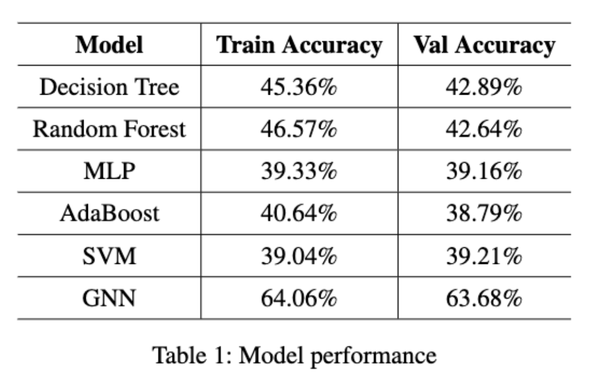

# DL_FinalProject
Bike-sharing has become a popular and environmentally friendly mode of transportation in recent years, offering people additional travel options and convenience while reducing pressure on traditional transportation systems. However, the increasing popularity of shared bikes has highlighted the need for more bike lanes and supporting facilities in many cities. In this project, we aim to provide urban planners with a tool to identify which segments of a city's streets are most in need of additional bike lanes and supportive measures, using Citi Bike in New York City as a case study. To achieve this, we employed three machine learning methods - Random Forest, MLP, and Graph Neural Network (GNN) - to predict the demand classes for shared bike usage on different street segments. Transportation planners and bike companies can use these predictions to prioritize investments in bike lanes and bike stops. Our final GNN model reached a classification accuracy of 63\%, which outperformed our other baseline models.

